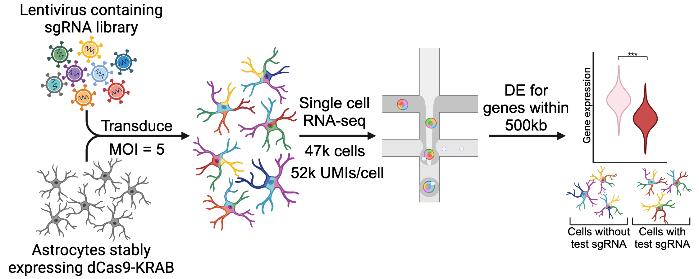

# CRISPRi screening of enhancers in human primary astrocytes

<picture>
    <source media="(prefers-color-scheme: dark)" srcset="./README_image_dark.png">
    
</picture>

## This repository contains analysis scripts for "CRISPRi Screening of Enhancers in Human Primary Astrocytes Identifies Regulatory Circuitry Disrupted in Alzheimer's Disease", by Green, Sutton *et al.* (2024)
Each directory contains a short readme describing its contents, with more general descriptions below.

#### UsefulFiles
This directory does not contain code, but rather small processed data files, results files, and helper functions. These are useful for re-running scripts. 

#### Raw_data_processing
Code to process raw scRNA-seq sequencing data.

#### CandidateEnhancerSelection
Code for selecting the candidate enhancer set of 979 open chromatin regions, and the design of sgRNAs targeting these regions.

#### CRISPRi_screen
Data processing and analyses of the NHA CRISPRi screen scRNA-seq data to identify functional enhancer-gene pairs.

#### Nanostring
Analyses of Nanostring nCounter data, used to validate hits in the CRISPRi screen.

#### Functional_annotation
These scripts annotate genes and enhancers with information on eRNA transcription (using TT-seq and CAGE), chromatin state (across development and tissues), expression dysregulation in brain disease, transcription factor binding (using TOBIAS footprinting analyses), and genetic variants including eQTL data. These annotations are based on TT-seq, RNA-seq and ATAC-seq data generated in the present study as well as published data listed in the Methods section of the paper (Functional annotation of genes and Gunctional annotation of enhancers).

#### Predictive_models
Code for benchmarking predictive models and training EGrf and EGrf-extended. Input data used to generate the training data is included in Predictive_models/1.Data and described in Predictive_models/1.Data/FileDescriptions.rtf

#### Manuscript_preparation_plots
Scripts that generate the manuscript figures and tables published in the manuscript. 

## Other
Questions should be directed to Gavin Sutton (gavin.sutton@unsw.edu.au / gavinjamiesutton@gmail.com) and Irina Voineagu (i.voineagu@unsw.edu.au)
